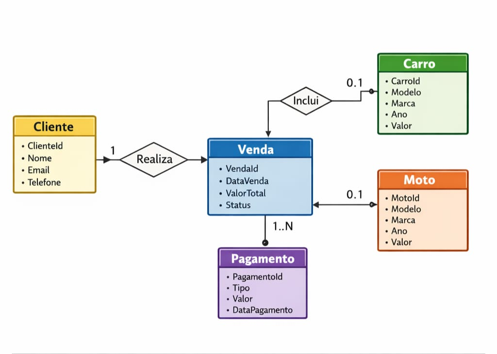

# CP1 — Modelo Entidade-Relacionamento e Projeto WebAPI

🔗 **Repositório:** [https://github.com/felipeflosii/automoveisVendasApi](https://github.com/felipeflosii/automoveisVendasApi)

## 👥 Integrantes

| Nome | RM |
|---|---|
| Luiz Felipe Flosi dos Santos | RM563197 |
| Arthur Brito da Silva | RM562085 |
| Pedro Brum Lopes | RM561780 |

---

## 📐 Diagrama MER



--- 

## 🏢 Domínio Escolhido

**Concessionária de Veículos**

Sistema de gestão de vendas de uma concessionária, contemplando o cadastro de clientes, controle do estoque de veículos (carros e motos), registro de vendas e gerenciamento de pagamentos.

---

## 🗂️ Entidades Modeladas

### `Cliente`
Representa o comprador. Possui `ClienteId` (PK), `Nome`, `Email` e `Telefone`. Um cliente pode realizar múltiplas vendas.

### `Carro`
Veículo do tipo automóvel disponível para venda. Possui `CarroId` (PK), `Modelo`, `Marca`, `Ano`, `Valor`, `Placa` e flag `Vendido`.

### `Moto`
Veículo do tipo motocicleta disponível para venda. Possui `MotoId` (PK), `Modelo`, `Marca`, `Ano`, `Valor` e flag `Vendida`.

### `Venda`
Registro da transação entre um cliente e um veículo. Possui `VendaId` (PK), `ClienteId` (FK), `CarroId` (FK, opcional), `MotoId` (FK, opcional), `DataVenda`, `ValorTotal` e `Status`.

### `Pagamento`
Representa um pagamento vinculado a uma venda. Possui `PagamentoId` (PK), `VendaId` (FK), `Tipo`, `Valor` e `DataPagamento`. Uma venda pode ter múltiplos pagamentos (ex.: entrada + parcelas).

---

## 🔗 Relacionamentos

| Entidades | Cardinalidade | Opcionalidade |
|---|---|---|
| Cliente → Venda | 1 : N | Um cliente pode ter zero ou muitas vendas; toda venda pertence a um cliente (obrigatório) |
| Venda → Carro | N : 0..1 | Uma venda pode estar associada a nenhum ou a um carro (opcional) |
| Venda → Moto | N : 0..1 | Uma venda pode estar associada a nenhuma ou a uma moto (opcional) |
| Venda → Pagamento | 1 : N | Uma venda possui um ou mais pagamentos; todo pagamento pertence a uma venda (obrigatório) |

> **Obs.:** Uma venda é sempre de **ou** um carro **ou** uma moto — nunca ambos ao mesmo tempo. Os campos `CarroId` e `MotoId` na entidade `Venda` são mutuamente exclusivos por regra de negócio.

---

## 🏛️ Estrutura do Projeto (Clean Architecture)

```
Projeto.sln
└── src/
    ├── Projeto.Domain/
    │   └── Entities/
    │       ├── Cliente.cs
    │       ├── Carro.cs
    │       ├── Moto.cs
    │       ├── Venda.cs
    │       └── Pagamento.cs
    ├── Projeto.Application/
    ├── Projeto.Infrastructure/
    └── Projeto.Api/
        ├── Program.cs
        ├── appsettings.json
        └── Properties/
            └── launchSettings.json
```

---

## 📐 Diagrama MER

O diagrama MER está disponível em [`/docs/mer.png`](./docs/mer.png).
